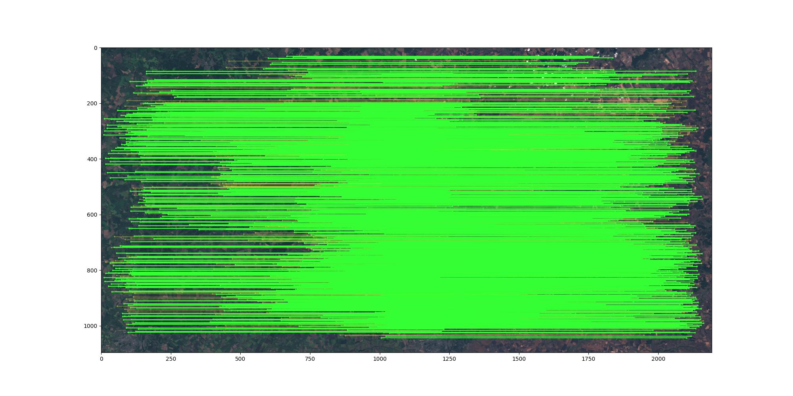

# Task 2: Satellite Image Matching with Sentinel-2

This task involves developing an algorithm for matching satellite images from different seasons using the Sentinel-2 dataset. The solution utilizes deep learning techniques with LightGlue and DISK for robust feature matching across seasonal variations.



## Table of Contents
- [Project Structure](#project-structure)
- [Task Overview](#task-overview)
- [Setup Instructions](#setup-instructions)
  - [1. Clone the Repository](#1-clone-the-repository)
  - [2. Install Dependencies](#2-install-dependencies)
- [Usage](#usage)
  - [1. Running Inference](#1-running-inference)
  - [2. Demo](#2-demo)
- [Solution](#solution)
  - [1. Data](#1-data)
  - [2. Algorithm Architecture](#2-algorithm-architecture)
- [Requirements](#requirements)

## Project Structure

The directory structure for Task 2 is as follows:

```
task2/
├── demo.ipynb                # Jupyter notebook with model demo
├── example.jpg               # Example of image matching
├── image_processing.ipynb    # Jupyter notebook for dataset creation and preprocessing
├── inference.py              # Python script for running inference
├── matcher.py                # Matcher class implementation
├── README.md                 # This README file
└── requirements.txt          # List of Python packages required
```

## Task Overview

In this task, you are required to:
1. **Dataset Creation:** Prepare a dataset of Sentinel-2 satellite images from different seasons.
2. **Algorithm Development:** Implement an image matching algorithm that works effectively across seasonal variations.
3. **Inference and Demo:** Create scripts and notebooks for running inference and demonstrating the algorithm's performance.

### Expected Outputs

The following outputs are expected for this task:
- **Jupyter notebook** ([`image_processing.ipynb`](image_processing.ipynb)): Explains the process of dataset creation and preprocessing.
- **Dataset**: [Google Drive](https://drive.google.com/drive/folders/1aRLJG6o4L209Aw_58FEGNJ7NGOBnUiW0?usp=sharing) to the prepared Sentinel-2 dataset.
- **Matching Algorithm** ([`matcher.py`](matcher.py)): Implementation of the image matching algorithm.
- **Inference Script** ([`inference.py`](inference.py)): Python script for running inference on image pairs.
- **Demo Notebook** ([`demo.ipynb`](demo.ipynb)): Jupyter notebook showcasing the algorithm's performance.

## Setup Instructions

### 1. Clone the Repository

First, clone the repository to your local machine:

```bash
git clone https://github.com/hnidan-oleksii/test-task-DL.git
```

### 2. Install Dependencies

Navigate to the `task2/` directory and install the required libraries:

```bash
cd task2
pip install -r requirements.txt
```

## Usage

### 1. Running Inference

To perform image matching on a pair of satellite images, use the `inference.py` script:

```bash
python inference.py --image1_path <path_to_first_image> \
                    --image2_path <path_to_second_image> \
                    --output_path <path_to_save_visualization> \
                    --image_size <height_after_scaling> <width_after_scaling>
```

### 2. Demo

For an interactive demonstration of the image matching algorithm, refer to the `demo.ipynb` notebook. This notebook provides examples of matching satellite images from different seasons and visualizing the results.

## Solution

### 1. Data

The solution used the dataset from [Kaggle](https://www.kaggle.com/code/denysv/mountain-ner).

Images after downscaling can be accessed by the [link](https://drive.google.com/drive/folders/1aRLJG6o4L209Aw_58FEGNJ7NGOBnUiW0?usp=sharing)

The `image_processing.ipynb` notebook contains detailed information about:
- Image preprocessing steps
- Downscaling satellite images

### 2. Algorithm Architecture

The solution uses a combination of deep learning-based feature detection and matching:

- **Feature Detection**: DISK (Dense Invariant Soft Keypoints) pretrained on depth estimation
- **Feature Matching**: LightGlue matcher for DISK
- **Geometric Verification**: MAGSAC algorithm for fundamental matrix estimation

The implementation in `matcher.py` provides:
- `LightGlue_DISK_Matcher` class for end-to-end image matching
- Configurable number of keypoint features
- Optional image resizing while maintaining quality
- Visualization of matched keypoints

## Requirements

The project requires Python 3.12.8 and the following main libraries:

- `jupyter` (for running notebooks)
- `kornia`
- `kornia-moons`
- `matplotlib`
- `numpy`
- `opencv-python`
- `rasterio`
- `torch`

For a complete list of dependencies, refer to `requirements.txt`.
